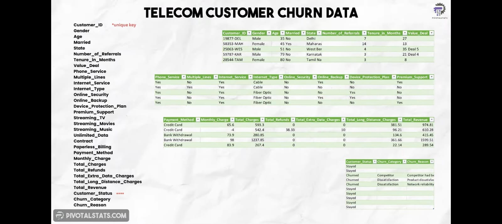
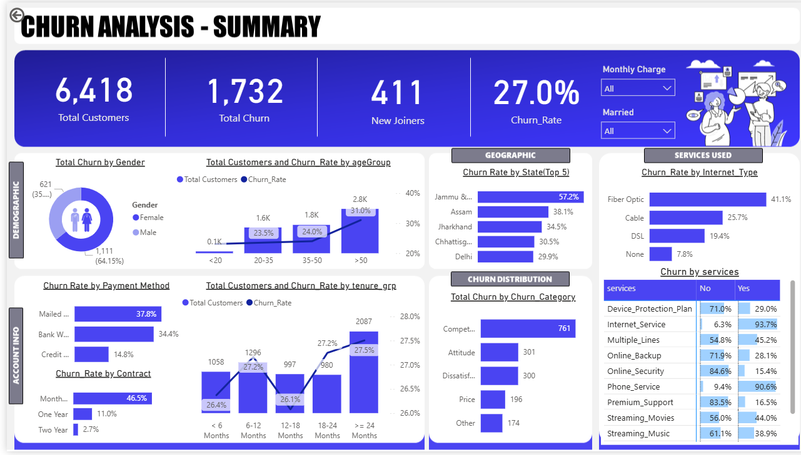
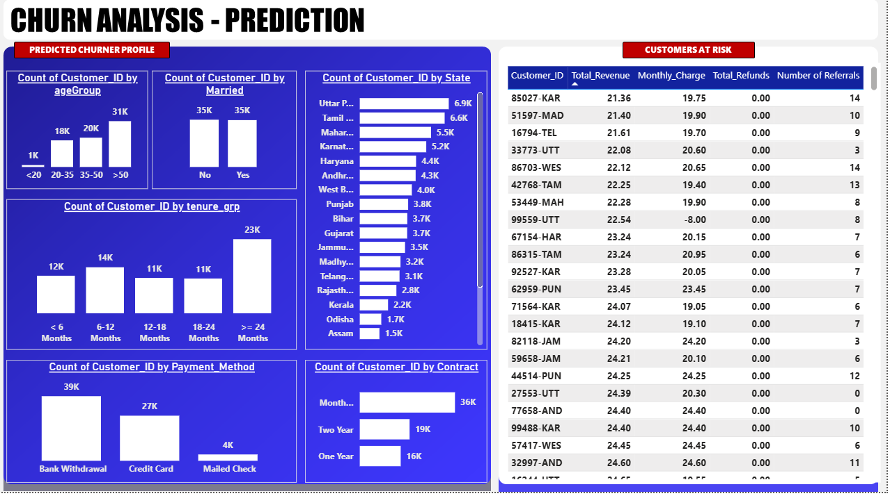

# 📦 Customer Churn Analysis & Prediction

An end-to-end Machine Learning project focused on analyzing and predicting telecom customer churn using Python, SQL Server, Power BI, and Random Forest Classification.

# 🚀 Project Overview
Customer churn is a major concern in the telecom industry. This project analyzes churn patterns, identifies key drivers, predicts future churners, and profiles at-risk customers using:

A summary dashboard
A prediction report
A trained machine learning model

# 🧰 Tech Stack

| Category      | Tools & Libraries                                |
| ------------- | ------------------------------------------------ |
| Database      | Microsoft SQL Server                             |
| Visualization | Power BI                                         |
| Programming   | Python                                           |
| Notebook      | Jupyter Notebook                                 |
| ML Algorithms | Random Forest Classifier                         |
| Libraries     | pandas, numpy, matplotlib, seaborn, scikit-learn |

# 🔄 Workflow

## 1️⃣ Data Import



Dataset contains:

* Customer ID (unique key)
* Personal Info (gender, senior citizen, etc.)
* Account Info (contract type, tenure, etc.)
* Service Subscriptions
* Revenue Data
* Customer Status (Target column)

# ETL & Data Preparation — SQL Server

* Database & Table Creation
* Removed Duplicates
* Handled NULL Values
* Created Views

ETL Framework:

* Data Source: CSV file
* MS SQL Server Management Studio: Import & Transform using Wizard
* SQL Server DB: Store data & create analytical views

# Dashboarding — Power BI
Used Power Query Editor to create new columns such as Chain Status and Monthly Charge Range.

## 📍 Summary Page Measures

```DAX
Total Customers = COUNT(Customer_Data[Customer_ID])

Total Churn = SUM(Customer_Data[Churn Status])

New Joiner =
CALCULATE(
    COUNT(Customer_Data[Customer_ID]),
    Customer_Data[Customer_Status] = "Joined"
)

Churn Rate = [Total Churn] / [Total Customers]
```

## 📍 Prediction Page Measure

```DAX
Count Predicted Churner =
COUNT(Predictions[Customer_ID]) + 0
```

# Sample Visuals 




# 🔍 Key Insights

* Senior Customers (age > 50) have a significantly higher churn rate.

* Short Tenure Churn: Users with < 2 months tenure are more likely to churn. In contrast, users with 1-year or 2-year contracts show much lower churn.
* Gender Disparity: Female customers churn more than male customers.
* Long-term contracts reduce churn significantly
* Customers using multiple telecom services tend to churn more
* Service-Based Churn: Users with Phone, Internet, and Unlimited Data services show 60%+ churn rate.

## 🧠 Machine Learning Module — Customer Churn Prediction

This Jupyter Notebook focuses on building and evaluating Machine Learning models to predict customer churn in the telecom industry.

### 📌 Key Features

### 🔧 Data Preprocessing

* Handled missing values using `fillna()`
* Removed unnecessary columns such as:

  * `Customer_ID`
  * `Churn_Category`
  * `Churn_Reason`
* Encoded categorical variables using `LabelEncoder`

### 🏗️ Model Building

Implemented Machine Learning models including:

* Random Forest Classifier


## 🧠 Machine Learning Module — Customer Churn Prediction

This Jupyter Notebook builds and evaluates a Random Forest Machine Learning model to predict customer churn in the telecom industry.

### 📌 Key Features

### 🔧 Data Preprocessing

* Handled missing values using `fillna()`
* Removed unnecessary columns such as:

  * `Customer_ID`
  * `Churn_Category`
  * `Churn_Reason`
* Encoded categorical variables using `LabelEncoder`
* Converted target labels:

  * Stayed → 0
  * Churned → 1

### 🏗️ Model Building

Implemented:

* Random Forest Classifier

### 📊 Model Evaluation

Evaluated model performance using:

* Accuracy Score
* Confusion Matrix
* Classification Report

  * Precision
  * Recall
  * F1-Score

### 📈 Feature Importance Analysis

Used Random Forest feature importance to identify the most influential features affecting customer churn.

### 🔮 Churn Prediction

* Predicted churn for newly joined customers
* Exported predicted churners to `Predictions.csv`
* Generated prediction-ready data for Power BI dashboards

### 💾 Output

* Saved prediction results as CSV
* Built a reusable churn prediction pipeline

### 📈 Results

* Achieved approximately 85% accuracy
* Generated actionable churn insights
* Identified high-risk customers for retention analysis
